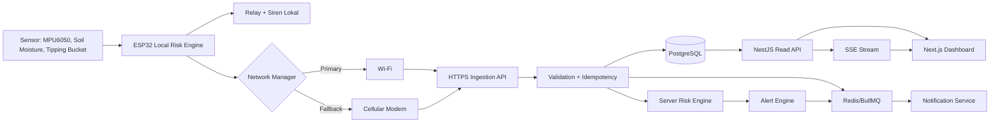
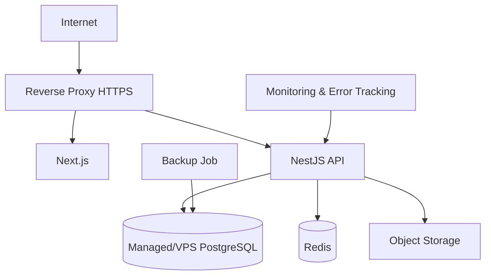

# System Architecture

> Historical extensible architecture. The active single-device runtime no longer uses Redis,
> BullMQ, SSE, reports, or object storage; see ADR 0006 and `20_SCOPE_RESET_SINGLE_DEVICE.md`.

## 1. Prinsip arsitektur

- Local-first safety: perangkat dan sirene dapat bekerja tanpa cloud.
- Server-authoritative monitoring: server menghitung risk assessment sendiri untuk dashboard.
- Append-oriented telemetry: data sensor tidak diedit melalui UI.
- Idempotent ingestion: retry aman.
- Multi-device ready: implementasi awal 1 alat bukan alasan membuat singleton.
- Connectivity-agnostic backend: Wi-Fi dan modem menggunakan kontrak payload yang sama.
- Auditability: konfigurasi dan tindakan operator dapat ditelusuri.

## 2. High-level architecture



## 3. Komponen

### 3.1 Firmware/perangkat

Tanggung jawab:

- Membaca sensor.
- Melakukan filter dan kalibrasi.
- Menghitung risk lokal.
- Mengaktifkan sirene lokal saat rule lokal terpenuhi.
- Mengirim telemetry.
- Mengelola Wi-Fi primary dan cellular fallback.
- Menyimpan antrean ketika offline.
- Retry dengan messageId yang sama.

### 3.2 Ingestion API

Tanggung jawab:

- Autentikasi device.
- Rate limiting per device.
- Validasi schema.
- Anti-replay dasar.
- Idempotency.
- Penyimpanan raw payload dan normalized readings.
- Trigger risk assessment dan event internal.

### 3.3 Risk engine

Pure domain service yang menerima:

- Nilai sensor.
- Status freshness.
- Threshold profile aktif.
- Validity flags.

Menghasilkan:

- Risk level.
- Reasons.
- Rule version.
- Evaluated timestamp.

### 3.4 Alert engine

- Membuat alert baru ketika kondisi naik atau kondisi operasional berubah.
- Menghindari duplicate active alert menggunakan dedupKey.
- Menambahkan alert event.
- Tidak auto-resolve critical alert tanpa rule eksplisit.

### 3.5 Read API

- Dashboard summary.
- Monitoring point detail.
- Telemetry series dengan downsampling.
- Alert list/detail.
- Device health.
- Map configuration.
- Reports.

### 3.6 Realtime

MVP memakai Server-Sent Events karena aliran dominan server ke client.

Event minimum:

- `telemetry.received`.
- `risk.changed`.
- `alert.created`.
- `alert.updated`.
- `device.status.changed`.

SSE tidak menjadi satu-satunya sumber data. Setelah reconnect, frontend selalu melakukan refetch REST.
Phase 05 memakai fetch-based SSE dengan bearer dan header organisasi. Event dipublikasikan melalui
Redis Pub/Sub hanya setelah transaksi domain commit agar semua instance API dapat melakukan fan-out.
Kegagalan publish tidak membatalkan transaksi; client pulih melalui refetch REST.

## 4. Deployment topology

### 4.1 Development

- Web lokal.
- API lokal.
- PostgreSQL Docker.
- Redis Docker.
- Mailpit Docker.
- MQTT broker opsional untuk eksperimen fase lanjutan.

### 4.2 Production awal



Saran awal:

- Satu VPS dapat digunakan untuk MVP, tetapi database backup harus disimpan di lokasi berbeda.
- Gunakan domain/subdomain terpisah atau routing `/api`.
- TLS wajib.
- Jangan membuka PostgreSQL dan Redis ke internet publik.

## 5. Monorepo target

```text
apps/
  web/
  api/
packages/
  config/
  types/
  ui/
  risk-engine/
  eslint-config/
  tsconfig/
infra/
docs/
specs/
```

`packages/risk-engine` tidak boleh bergantung pada NestJS atau UI agar mudah diuji dan dapat dipakai simulator.

## 6. Data flow telemetry

1. Device membuat `messageId` dan menaikkan `sequence`.
2. Device menentukan network path.
3. Device mengirim payload.
4. API memverifikasi credential.
5. API memvalidasi timestamp dan schema.
6. API melakukan insert idempotent.
7. API menghitung server risk.
8. API menyimpan risk assessment.
9. Alert engine mengevaluasi perubahan.
10. Event dipublikasikan ke SSE/queue.
11. Dashboard refetch data terbaru.
12. Device menghapus item antrean setelah menerima acknowledgement HTTP sukses.

## 7. Scalability path

Tahap awal cukup memakai PostgreSQL biasa. Bila volume meningkat:

- Tambahkan partitioning telemetry berdasarkan waktu.
- Pertimbangkan TimescaleDB.
- Tambahkan batch ingestion.
- Pindahkan event bus ke broker terpisah.
- Gunakan MQTT hanya bila kebutuhan device count/connection mengharuskan.

Jangan mengoptimalkan berlebihan sebelum metrik nyata tersedia.

## 8. Boundary arsitektur Phase 06

Phase 06 menambahkan tiga boundary tanpa mengubah sumber kebenaran monitoring:

- **Map projection** membaca konfigurasi Site immutable dan projection risiko/konektivitas yang
  authoritative. Geometry disimpan sebagai GeoJSON WGS84/EPSG:4326 yang provider-independent;
  backend tidak melakukan geocoding, directions, atau automatic routing.
- **Private document storage** menyimpan byte SOP dan hasil report di object storage privat.
  PostgreSQL hanya menyimpan metadata, checksum SHA-256, versi/status, dan opaque object key.
  Download selalu melewati API terautentikasi; tidak ada public/permanent URL.
- **Report worker** memakai BullMQ untuk pembuatan PDF asinkron. API hanya membuat durable job,
  worker melakukan retry terbatas dan idempotent, lalu menulis artifact metadata. Kegagalan worker
  disanitasi dan tidak membocorkan stack/provider detail.

Upload SOP memakai validasi berlapis MIME, ekstensi, ukuran, dan PDF magic signature. Ini adalah
content containment, bukan klaim bahwa file bebas malware. Bila object upload berhasil tetapi
transaksi metadata gagal, implementasi wajib melakukan compensating delete. Artifact report
berumur 90 hari; metadata job dipertahankan dan regenerasi selalu membuat job baru.
